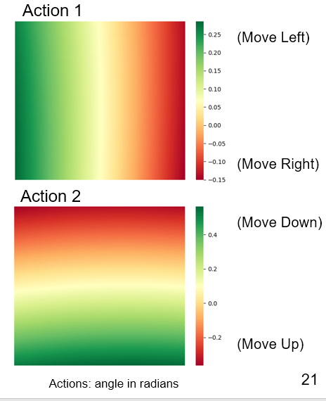

EEE 587: Optimal Controls - Robotic Arm
---

Data Collection for Bilinear Model
---

* Arm is given random control inputs, and current box location, next box location and corresponding control input values are saved.
* If box goes out of camera frame, a arm is reinitialized at a random location from which bix is visible again.
* Data is used to fix weights for bilinear model, which helps predict the next box location given the current box location and control input. 


Performance before Fitted Q Iteration (using initialized weights)
---

* Weights for Q function initialized to ```w = 1, lambda_1 = 1, lambda_2 = 1```.
* Performance of arm visualized with these initialized weights.
* Arm seems to track box in most cases but lots of oscillations seen.


* State-action space (in camera frame): 


Performance after Fitted Q Iteration Weights
---

* Fitted Q iteration has been performed for ```iterations = 10, batch_samples = 2000, gamma = 0.9, exploration_policy = ~N(current_policy, 0.2)```
* No oscillations seen. Arm tracks box smoothly.


* State-action space (in camera frame): 




Required Python Packages
---

```
scipy
pyyaml
rospkg
defusedxml
theano
netifaces
```


Testing File
---

1. git clone
2. catkin_make
3. source devel/setup.bash
4. roscore
5. cd ./catkin_ws_py/src/simple_arm/scripts/
6. python testing_visual_servoing.py


Demo Video Links:
---

1. Data Collection: 

```https://www.youtube.com/watch?v=fxEXsMEiook&feature=emb_title```

2. Results with Zero Iterations:

```https://www.youtube.com/watch?v=f0ve1BEQK2k&feature=emb_title```

3. Results with Fitted Q-Iterations:

```https://www.youtube.com/watch?v=u14srrIapOg&feature=emb_title```


Misc. Notes:
---

To launch Robot Arm Nodes Alone (without Q Learning Node):

```
source devel/setup.bash
roslaunch simple_arm robot_spawn.launch
```

Python scripts located at:

```
catkin_ws_py/src/simple_arm/scripts
```


References:
---
* Richard S. Sutton, Andrew Barto, "Reinforcement Learning: An Introduction"
* Alex Lee, et. al., Learning Visual Servoing with Deep Features and Fitted Q-Iteration ([paper](https://arxiv.org/abs/1703.11000), [code/notes/slides](https://rll.berkeley.edu/visual_servoing/))
* Udacity Simple Arm URDF ([link](https://github.com/udacity/simple_arm))

